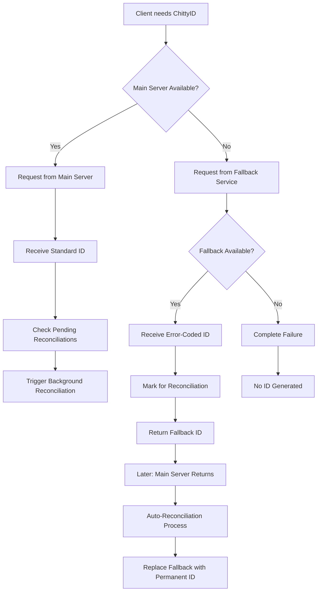

# ChittyID Secure Fallback Architecture

## Problem Statement
AI models were inadvertently generating invalid ChittyIDs during network failures due to uncontrolled local fallback logic. This created data integrity issues and violated cryptographic soundness requirements.

## Solution Architecture

### Core Principles
1. **NO Local Generation**: Clients CANNOT generate ChittyIDs under any circumstances
2. **Centralized Control**: All IDs, including fallbacks, come from server infrastructure
3. **Cryptographic Soundness**: Even fallback IDs maintain full cryptographic integrity
4. **Automatic Reconciliation**: Fallback IDs are automatically replaced with permanent IDs

## System Components

### 1. Main ChittyID Server (`id.chitty.cc`)
- Primary source for all standard ChittyIDs
- Handles reconciliation of fallback IDs
- Maintains cryptographic integrity
- Format: `AA-C-XXX-SSSS-T-YM-C-X` (domain 'C' for standard)

### 2. Fallback Service (`fallback.id.chitty.cc`)
- Highly available, redundant infrastructure
- Issues pre-authorized, error-coded ChittyIDs
- Separate from main server for resilience
- Format: `AA-E-XXX-SSSS-T-YM-C-X` (domain 'E' for error/fallback)

### 3. Client Architecture
- Stripped of ALL generation capability
- Request-only interface
- Automatic fallback handling
- Reconciliation tracking

## Fallback ID Lifecycle



## Fallback ID Properties

### Error-Coded Format
- Domain field: 'E' indicates error/fallback state
- Cryptographically sound: Maintains all validation rules
- Traceable: Can be tracked back to fallback service
- Temporary: Must be reconciled when possible

### Example IDs
- Standard: `AA-C-USR-1234-I-25-7-X`
- Fallback: `AA-E-USR-5678-I-25-8-Y`
- Post-reconciliation: `AA-C-USR-9012-I-25-9-Z`

## Reconciliation Process

### Automatic Trigger
1. Client successfully connects to main server
2. Client checks for pending fallback IDs
3. Batch reconciliation request sent
4. Server validates and replaces fallback IDs
5. Client updates local references

### Manual Reconciliation
```javascript
// Reconcile specific fallback ID
const permanentId = await client.reconcileChittyID('AA-E-USR-5678-I-25-8-Y');

// Get all pending reconciliations
const pending = client.getPendingReconciliations();

// Trigger batch reconciliation
await client.triggerReconciliation();
```

## Security Guarantees

### Prevention of AI Abuse
- AI models have NO access to generation logic
- Cannot create IDs during outages
- Must use server-provided IDs only
- Fallback IDs are cryptographically valid

### Data Integrity
- All IDs traceable to authorized servers
- Fallback IDs marked with error domain
- Automatic reconciliation ensures consistency
- No "orphan" IDs can be created

### Audit Trail
- Server logs all ID generation
- Fallback service maintains separate logs
- Reconciliation creates audit entries
- Complete lifecycle tracking

## Implementation Status

### Completed
- ✅ Removed all local generation code
- ✅ Created server-only client (`client.js`)
- ✅ Implemented fallback client (`fallback-client.js`)
- ✅ Added reconciliation system

### Server Requirements
The server infrastructure must implement:

1. **Main Server Endpoints**:
   - `POST /api/chittyid/generate` - Standard generation
   - `POST /api/chittyid/reconcile` - Replace fallback IDs
   - `GET /api/chittyid/verify/{id}` - Verify any ID

2. **Fallback Service Endpoints**:
   - `POST /api/chittyid/fallback` - Issue error-coded IDs
   - Must be on separate, redundant infrastructure
   - Higher availability SLA than main server

3. **ID Generation Rules**:
   - Main server: Domain 'C' for standard IDs
   - Fallback service: Domain 'E' for error/fallback IDs
   - Both maintain full cryptographic validation

## Migration Path

### For Existing Systems
1. Deploy new client libraries
2. Remove local generation code
3. Configure server endpoints
4. Test fallback scenarios
5. Monitor reconciliation rates

### For AI Integration
1. Update AI model prompts to use client-only approach
2. Remove any references to local generation
3. Implement error handling for complete failures
4. Add reconciliation status tracking

## Monitoring & Metrics

### Key Metrics
- Fallback ID generation rate
- Reconciliation success rate
- Time to reconciliation
- Failed reconciliation attempts

### Alerts
- High fallback usage (main server issues)
- Failed reconciliations
- Both services unavailable
- Unusual ID request patterns

## Conclusion
This architecture eliminates the risk of invalid ChittyID generation by AI models or any other clients, while maintaining system availability through server-controlled fallbacks. The centralized approach ensures cryptographic integrity and enables comprehensive audit trails.